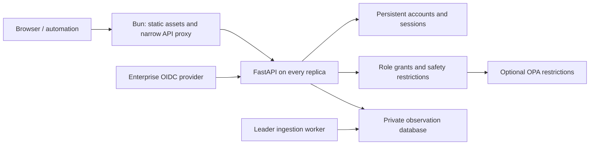

# Celery Insights authentication and authorization design

Status: proposed architecture and implementation plan, not implemented. Prepared 2026-10-03 against the current repository. Supporting standards and limitations: [research](auth-research.md).

Tracking: [configuration prerequisite #138](https://github.com/danyi1212/celery-insights/issues/138), [authentication and builtin roles #139](https://github.com/danyi1212/celery-insights/issues/139), and [custom OPA authorization #140](https://github.com/danyi1212/celery-insights/issues/140), in that implementation order.

## Decisions

- One Celery cluster per installation initially; stable installation ID in the control store. Separate deployments remain the boundary between independently operated clusters.
- Support local accounts and enterprise OpenID Connect (OIDC), including hybrid deployments.
- Built-in roles grant permissions. Optional OPA policies may restrict those grants; they cannot grant a permission a role lacks.
- The initial account is a normal administrator with a unique credential. Single-user installations use the same security boundary as multi-user installations.
- All access to observation data passes through the application backend, including live updates, exports, analytics, and automation.

## Why the current architecture must change

`bun-entry.ts` currently exposes SurrealDB HTTP and WebSocket routes, provisions fixed database credentials, and runs Python only on the ingester leader. `src/components/surrealdb-provider.tsx` authenticates directly to SurrealDB; hooks issue SQL and subscribe to broad live streams before filtering in the browser. FastAPI settings, exports, metrics, and Bun diagnostics have separate access paths.

Adding account screens or OPA checks to UI buttons would leave these access paths available to other clients. The backend must become the sole enforcement point. Accounts must also survive task cleanup, snapshot import, replay mode, and leader changes.



Bun serves assets and forwards a fixed application route set. FastAPI owns authentication and authorization once. Remove `/surreal/*`, browser database credentials, arbitrary query endpoints, and any privileged fallback proxy. Keep SurrealDB on a private interface/network. Production dev-server proxy configuration must preserve this boundary.

Run the API on every replica independently of ingestion leadership. Start/stop a separate ingestion worker under the existing leader mechanism, with fencing where a stale leader can cause conflicting work. A leader transition must not interrupt account administration, sessions, or ordinary task APIs.

## Customer setup and account management

### First installation

1. Operator selects local, OIDC, or hybrid authentication and supplies the public URL and persistent control-store connection.
2. For local/hybrid mode, operator supplies a bootstrap password through either a secret-backed environment variable or a mounted secret file and explicitly requests initial administrator creation, or runs an operator CLI to create it. Support both delivery methods; recommend read-only file mounts where practical. Never ship a universal password or write it into logs.
3. Bootstrap executes atomically across replicas against durable initialization state. Consume it once; changing the secret or restarting does not reset an account. Empty accounts after initialization must not reopen public enrollment.
4. OIDC-only mode requires explicit issuer/client configuration and an allowlisted initial administrator subject or group. No default administrator identity inferred from email or the first visitor.
5. Until initialized, expose only minimal health/setup status; observation APIs remain unavailable. Setup takes place through operator configuration/CLI, without a publicly claimable first-user screen.

Use `admin` as an optional initial username, not a special authorization identity. Customers who need only one account stop here. No default-account fallback when another login fails.

### Accounts page

An administrator can create local accounts, assign role grants, disable accounts, revoke sessions, reset credentials, and inspect authentication/audit metadata. Self-service supports password/MFA changes and listing/revoking one's own sessions. Registration is closed by default.

Local onboarding uses a one-time, hashed, expiring activation token delivered by the operator through an existing trusted channel; email integration is optional. Activation requires a new password. Never show an existing password. Temporary credentials require replacement before accessing task data.

OIDC accounts show issuer/subject and mapped grants. Local profile edits cannot change provider groups. Configuration controls group-to-role mappings; unrecognized groups grant nothing. JIT provisioning is opt-in and requires an explicitly eligible group or preapproved subject. Never auto-link local and OIDC accounts by matching email. Account linking requires a separately designed, authenticated administrative procedure.

Protect the last eligible administrator against concurrent disable/deletion/role removal. This safeguard prevents routine accidental lockout; it cannot guarantee an external IdP or OPA policy will permit login. Recovery is an audited operator CLI procedure with host/control-store authority. An OPA outage never triggers an HTTP administrator bypass; policy recovery uses the operator's OPA deployment process.

### Credential and session controls

- Local passwords: Argon2id using a maintained library, benchmarked parameters at least OWASP's documented floor, common/compromised-password blocklist, minimum 15 characters, support at least 64, no arbitrary composition requirements or routine forced rotation. Shared account/IP throttling, generic errors, bounded concurrent password-hashing work, and audited recovery. These are product defaults, not a claim of NIST/FIPS certification.
- Local privileged accounts: require enrolled MFA in the production profile. Prefer WebAuthn through a maintained implementation; TOTP plus hashed recovery codes can be a deliberately scoped initial implementation. Administrator password reset must not silently erase MFA.
- OIDC: server-side Authorization Code + PKCE S256, state/nonce bound to the login transaction, exact configured issuer and redirect URI, signature/algorithm/audience/expiry validation. Identity key is `(issuer, sub)`. Keep provider tokens server-side. Validate configured assurance requirements; do not assume a group claim proves MFA. See [OIDC Core](https://openid.net/specs/openid-connect-core-1_0.html) and [OAuth security BCP](https://www.rfc-editor.org/rfc/rfc9700.html).
- Both methods issue the same opaque application session. Persist only its token hash; cookie `__Host-ci_session`, `Secure`, `HttpOnly`, `SameSite=Lax`, `Path=/`, no Domain. CSRF token plus Origin validation for cookie-authenticated mutations; WebSocket handshake Origin validation as well. Test the selected OIDC callback response mode.
- Proposed configurable defaults: 30-minute idle expiry, 12-hour absolute expiry, recent authentication within 5 minutes for account/credential administration and sensitive diagnostics. Rotate sessions on login and security changes. Disabling an account or changing grants increments its security version and invalidates affected sessions.
- Consult authoritative account/session state on each request and before live delivery. Provider group removal is only visible when claims refresh: set an explicit bounded reauthentication window, proposed 15 minutes, with a shorter privileged window; implement supported provider back-channel logout separately. Do not promise immediate IdP revocation without such integration.
- Service accounts receive separately scoped, expiring, revocable bearer tokens, stored hashed, for automation/metrics. Effective grants intersect token scope, principal permissions, and OPA. Never put tokens in URLs or browser storage. Do not treat an arbitrary OIDC ID token as an API access token.

## Persistent control plane

Keep accounts, credential hashes/MFA material, external identity links, roles/grants, sessions, service tokens, initialization state, security versions, and audit records separate from observation tables.

A persistent control database may use the existing SurrealDB infrastructure, with a separate database and credentials. For a single replica, a durable embedded instance is supported. For multiple replicas, all replicas use the same external durable control store and distributed throttling state. Production authentication cannot depend on an ephemeral task database or browser state; no sticky sessions are required.

Use separate provisioning, control-store, ingestion, and query credentials at the narrowest supported scope. Provisioning/root credentials are unavailable to browser paths and steady-state request handlers. System users bypass SurrealDB table/field permissions, so these permissions do not substitute for application authorization. [SurrealDB permissions](https://surrealdb.com/docs/learn/security/authorization/permissions-and-row-level-security)

Task imports, retention, clears, and ordinary task backups cannot touch the control database. Native SQL snapshot replay with a root credential could cross a logical database boundary: migrate to validated data-only archives, or run legacy native replay in an isolated disposable database process with no control-store credentials or network reachability. A separate database name alone does not safely contain root import.

Control backups require a separate operator procedure, encryption/access controls, and a documented restore process that revokes sessions and service tokens. Do not resurrect previously valid credentials merely by restoring a task snapshot. Secrets and account tables never enter downloadable diagnostics.

## Permission model

Prefer three familiar role presets plus explicit sensitive-data grants. Roles are named permission sets, not conditionals scattered across endpoints.

| Preset/grant | Intended access |
| --- | --- |
| Viewer | Task/worker metadata and analytics over permitted records; no raw payloads |
| Operator | Viewer plus selected operational changes such as cleanup/retention and supported task controls |
| Administrator | Account/security administration and all built-in grants; still subject to OPA and deployment safety restrictions |
| Sensitive task data | Explicit additional grants for inputs, results, failures/tracebacks, raw events, and worker inspection |

Operator does not automatically receive payload visibility. Task names, queue labels, error messages, worker inspection, and logs can themselves contain sensitive information; define response groups conservatively and document what metadata contains.

Initial catalog:

- `task.metadata.read`, `task.input.read`, `task.result.read`, `task.failure.read`, `event.raw.read`, `worker.metadata.read`, `worker.inspect.read`, `analytics.read`.
- `task.export`, `backup.export`, `backup.import`, `history.clear`, `retention.update`, `cleanup.run`.
- `diagnostics.export`, separately restricted `diagnostics.secrets.export`, `metrics.read`.
- `accounts.manage`, `roles.manage`, `sessions.revoke`, `service_tokens.manage`, `audit.read`.
- Add explicit permissions for each newly introduced Celery mutation; never reuse a generic “write” check.

Exports require both the export permission and every included row/field permission. Secret diagnostics should be disabled by default and require recent MFA plus explicit deployment enablement; ordinary exports always redact secrets. Replay/read-only deployment restrictions are hard checks that even an administrator or OPA allow cannot override.

## Enforcement interface

Implement a small backend authorization module with explicit operations:

```text
authenticate(request) -> Principal
authorize(principal, action, trusted_resource, context) -> Decision
read_scope(principal, action, context) -> ValidatedReadScope
project(principal, scope, record) -> AuthorizedResponse
```

The principal includes immutable account ID, verified provider identity, resolved grants, security version, and authentication assurance. Resource descriptors come from server-loaded records. Context includes installation ID, verified request/session properties, and the current policy version. Client-supplied IDs select resources; client-supplied roles, headers, queue scopes, or assurances never establish authority.

Role grants and deployment safety checks run first. In builtin mode they are sufficient; in OPA mode a valid policy restriction must also pass. Denial occurs before any mutation or data serialization. Protect direct API use, internal fan-out, jobs initiated by a user, and response data from mutations—not just page navigation.

For changes to resource attributes used in decisions, authorize against the authoritative version and execute conditionally against that version. Retry requires a fresh decision. Celery commands cannot generally be transactional with the database: record an authorized intent, report accepted/dispatched outcomes accurately, and define what happens if permissions change before queued dispatch. Reauthorize delayed dispatch rather than preserving an indefinite allow.

## OPA contract

OPA is optional. Explicit provider mode is `builtin` or `opa`; enabling OPA does not create a fallback-to-builtin error path. The endpoint and trusted policy location are operator configuration, never supplied by a browser.

Use versioned decision input with subject, action, minimal resource metadata, and context. Do not send passwords, cookies, access tokens, task argument/result bodies, or raw traceback contents. A proposed point-decision endpoint is `POST /v1/data/celery_insights/decision`.

Require a validated result object with `schema_version`, boolean `allow`, and an identified policy revision. Only exact `allow: true` passes. Undefined OPA documents can return HTTP 200 without `result`: HTTP success alone is insufficient. Undefined/malformed results, unsupported versions, evaluation errors, deadline expiration, and connection failures stop protected operations. Known denial returns 403 (or nondisclosing 404 for inaccessible object IDs); policy availability failures return 503 without data or side effects. [OPA REST API](https://www.openpolicyagent.org/docs/rest-api)

Prefer a local OPA process/sidecar per API replica; also support an authenticated central endpoint. Use TLS with verified CA and optional mTLS across hosts. Keep policy-management APIs unavailable to browser/application users. Pin an OPA release, disable unused builtins/egress, bound evaluation cost, and test its actual APIs. Operator policy publishing is trusted code administration.

Publish reviewed, signed bundles with immutable revisions and schema checks. A rollout coordinator establishes the required revision; replicas without it deny protected traffic/become unready. Define an explicit maximum permitted bundle age and an audited rollback process. An approved persisted bundle within its freshness window is usable; failure to evaluate never means allow. Air-gapped installations may deliberately pin a reviewed revision with an operator-defined validity policy.

Audit principal/action/resource/decision ID/policy revision and the actual operation outcome. Redact both application and OPA logs; exclude credential and payload bodies. An authorization allow log does not prove an operation executed.

### Read scopes: the production query constraint

Custom read policies must cover list membership, detail reads, workflow edges, live changes, search, exports, and aggregates identically. Checking one page-level permission then sending all rows is invalid. Filtering unauthorized rows after pagination produces incorrect views and may leak global counts or cursors.

OPA does not document a native SurrealQL compile target. This design therefore chooses an **application-owned constrained read-scope contract** for the first production release; it does not claim arbitrary Rego can be translated into SurrealQL. [OPA filtering](https://www.openpolicyagent.org/docs/filtering), [research alternatives](auth-research.md#lists-live-updates-fields-and-aggregates)

Rego evaluates trusted principal/context and returns a versioned visibility expression over an allowlisted resource descriptor, plus allowed field groups. Initial expressions support bounded `all`/`any`, equality and bounded membership on installation ID, task type, queue, worker identity, status, and timestamps. Define exact null/missing/type/collation semantics. Unknown operators, excess depth/size, unsupported fields, or malformed values deny the query. Never accept raw SQL or arbitrary returned code.

The backend compiles this validated expression into parameterized SurrealQL and implements the same predicate for live records. Intersect it with built-in grants and the fixed installation scope. The same expression controls detail queries and counts; pagination, aggregations, workflow traversal, and exports run over that authorized relation. Field groups are uniform for the scope initially; if a policy needs finer field access, require a narrower request scope or omit the field rather than emit too much.

For read access, this expression is the canonical policy: an independent point rule must not contradict it. Point decisions cover mutations and administrative operations. This is an intentional restriction on the custom-policy API. Arbitrary resource-dependent Rego read decisions require a separate bounded per-record evaluation mode; that mode cannot promise efficient exact counts or unlimited analytics and is deferred.

Do not permit filtering, searching, sorting, grouping, or exception previews over hidden payload fields merely because output is redacted. Validate query operations against field grants before evaluation. Producer-controlled queue/task metadata is useful for filtering, but cannot serve as a trustworthy tenant isolation boundary against a malicious producer. One cluster per installation avoids claiming that isolation.

Acceptance requires a prototype proving compiler/live-predicate equivalence, exact authorized counts, and realistic-volume performance. If the contract cannot implement a policy safely, reject it or disable the affected feature explicitly. Do not silently broaden the scope.

### Live updates and revocation

Replace browser database live queries with authenticated backend SSE/WebSocket subscriptions. The backend obtains an authorized snapshot and emits only projected authorized changes. Bound subscription scope, lifetime, queue size, and fan-out; slow consumers disconnect and reconnect through a fresh authorized snapshot.

Check authoritative session/account state and active policy revision before each delivery. Recompute read scopes on role/policy changes; use shared version notifications and a proposed maximum five-second stream invalidation interval, with version/state checks preventing delivery under a known stale grant. Disconnect/invalidate when reevaluation is unavailable. Do not cache allows across requests initially.

Send removal events only for IDs the subscriber previously saw; hidden rows never enter its stream. When access narrows, invalidate affected browser caches and resnapshot. Already delivered data cannot be recalled. Test snapshot/event ordering and reconnect catch-up so transitions do not bypass projection or visibility.

## Deployment configuration

Implement the [TOML configuration prerequisite](configuration.md) before adding authentication settings. Bun exclusively loads, resolves secrets, validates, and redacts configuration, then passes the necessary resolved subset to Python through a private process handoff. Every setting has a canonical TOML path; only registered deployment/secret inputs have environment overrides. There is no parallel YAML loader or independent Python configuration precedence. Proposed names below are new, not currently supported. Show nonsecret effective settings and their provenance to administrators.

Support both `CI_BOOTSTRAP_PASSWORD` (secret value) and `CI_BOOTSTRAP_PASSWORD_FILE` (path to a mounted secret). The latter maps to `authentication.bootstrap.password_file` below. Require exactly one winning password source when password bootstrap is requested; reject direct-value and file sources in the same precedence layer, even when they contain the same value. A single environment source may override a lower-priority TOML source, as specified in the prerequisite. Reject empty credentials and unreadable winning files, without fallback. Never include secret values in configuration output, validation errors, debug bundles, or logs. Apply the prerequisite's single-terminal-newline file convention.

In Kubernetes, both methods consume an existing Secret. Recommended delivery mounts only the needed key as a read-only file accessible to the application user. Environment delivery uses `secretKeyRef`, for example:

```yaml
# Fragment of the Celery Insights container configuration; proposed app setting.
env:
  - name: CI_BOOTSTRAP_PASSWORD
    valueFrom:
      secretKeyRef:
        name: insights-bootstrap
        key: password
```

For file delivery, mount the Secret at `/run/secrets/insights` and set `CI_BOOTSTRAP_PASSWORD_FILE=/run/secrets/insights/password`; do not also set `CI_BOOTSTRAP_PASSWORD`. Avoid literal secret values in manifests or checked-in configuration. Limit Secret access and enable encryption at rest. File mounts are the preferred default because environment variables are more prone to accidental diagnostic exposure; either method remains readable by the application that consumes it. [Kubernetes Secrets](https://kubernetes.io/docs/concepts/configuration/secret/), [security checklist](https://v1-33.docs.kubernetes.io/docs/concepts/security/security-checklist/)

Both methods retain one-time bootstrap semantics: after initialization, updates to the Secret or environment never reset the account. Remove the bootstrap credential from the deployment after successful initialization. Apply the same mutually exclusive value/file input convention to OIDC client secrets and database credentials.

```toml
schema_version = 1

[installation]
public_url = "https://insights.example.com"

[authentication]
mode = "hybrid" # local | oidc | hybrid

[authentication.bootstrap]
enabled = true # consumed once; remove after initialization
admin_username = "admin"
password_file = "/run/secrets/insights-bootstrap-password"

[authentication.local]
privileged_mfa_required = true

[authentication.oidc]
issuer = "https://identity.example.com"
client_id = "celery-insights"
client_secret_file = "/run/secrets/insights-oidc-client-secret"
jit_provisioning = false

[authentication.oidc.group_roles]
insights-viewers = ["viewer"]
insights-operators = ["operator"]
insights-admins = ["administrator"]

[authorization]
provider = "opa" # builtin for installations without custom policies

[authorization.opa]
url = "http://127.0.0.1:8181" # same-host process only
decision_path = "/v1/data/celery_insights/decision"
read_scope_path = "/v1/data/celery_insights/read_scope"
timeout_ms = 200 # starting value; validate against measurements

[database.control]
url = "wss://identity-store.example.internal/rpc"
credentials_file = "/run/secrets/insights-control-credentials"
```

The example is proposed schema; TOML values have no implicit environment substitution. In Kubernetes a same-pod sidecar can use loopback; a separate Compose service requires private networking and authenticated transport. VM deployments can run an adjacent OPA process. Builtin authorization has no OPA infrastructure dependency. Local accounts require no email or external identity service; hybrid/OIDC uses customer-operated identity infrastructure.

Production requires HTTPS at the configured public origin, durable identity state, explicit secrets, and safe proxy settings. Trust forwarded headers only from configured proxy addresses; derive redirects from the configured URL, not arbitrary Host headers. Gate `/metrics` with a service credential and explicit metrics scope; public liveness exposes no task labels/data. Frontend-only demos remain isolated synthetic data adapters and cannot become access paths to production APIs.

Account/role/session changes use the Accounts UI, administrative API, or CLI and persistent control state. Operator configuration owns OIDC trust, role mapping, OPA, network/TLS, and bootstrap; changing a bootstrap secret through either delivery method does not reconcile/overwrite live accounts. GitOps-managed grants, if later supported, need an explicit ownership model rather than two writers racing.

## Implementation sequence

0. **Establish configuration ownership:** complete the [TOML prerequisite](configuration.md), including the full current-setting catalog, selected env overrides, Bun-owned resolution/validation, secret delivery, and narrow Python handoff. Urgent containment fixes can proceed in parallel with this prerequisite.
1. **Contain existing exposure:** restrict DB ingress, replace fixed credentials, gate every HTTP/WS/diagnostic route, fix debug-bundle secret inclusion and CSV formula injection. Keep temporary controls visibly scoped; a UI-only login is not a finished boundary.
2. **Build the application data boundary:** always-on API per replica, separate leader ingestion, typed task/worker/event/analytics endpoints, server live subscriptions, frontend data adapter. Remove raw database browser/proxy access and legacy fallbacks. Verify feature parity before retiring old paths.
3. **Introduce durable identity:** control-store migrations, atomic bootstrap, local passwords/MFA, shared sessions/throttling, service tokens, account administration, OIDC validation and explicit mapping. Replace frontend-only login state with `/api/session` and server-enforced sessions.
4. **Enforce the permission catalog:** cover all routes, response projections, query operations, workflow edges, exports, metrics, imports and diagnostics. Redesign replay/import isolation. Add version checks and stream revocation. The UI hides unavailable actions and explains denial, while the server remains authoritative.
5. **Add OPA:** prototype the read-scope compiler first; pin/test OPA, provide sample deny-only policies and field restrictions, signed bundle operation, health/freshness, revision rollout, outage behavior and audit correlation. No production OPA promise until the query equivalence/performance gate passes.
6. **Release with deployment and migration evidence:** Compose/Kubernetes/VM examples, shared-store HA recipe, isolated demo profile, recovery/backup runbooks, documented compatibility constraints, and the acceptance matrix below.

Each step is a reviewable change set; release readiness depends on completion of all required controls, not the presence of a login page. No application code has been changed by this plan.

### Migration

Explicitly migrate an existing configured frontend password to the initial named local account once, hashing it server-side and requiring change/MFA enrollment as appropriate. Do not silently switch an authenticated install to guest mode. Existing installations without a password require operator bootstrap before protected access; publish this breaking security change.

Invalidate legacy browser database tokens, remove obsolete viewer/root users and proxy routes, and rotate exposed database credentials. Preserve task history separately from identity initialization. Support a defined migration version with rollback that cannot re-enable public DB access or restore old sessions. Back up identity state separately before changes; never use task replay as an authentication rollback.

## Acceptance gates

- Every endpoint and stream has an owner, permission, resource scope, field projection, and negative test. Exercise direct API requests, old proxy paths, raw DB protocols, exports, settings, diagnostics, metrics, workflows, and reconnect behavior.
- Test role × action × field × authentication mode. Viewer cannot infer hidden payloads via search/sort/counts. Operator cannot change accounts. OPA cannot expand role grants, and administrators cannot bypass OPA or read-only restrictions.
- OIDC tests cover state/nonce/PKCE replay, issuer/audience mismatch, key rotation, malicious redirects, forged groups/proxy headers, and same-email account collisions. Local tests cover throttling, bootstrap races, resets, MFA/recovery, CSRF, and session rotation.
- Configuration checks cover equivalent bootstrap behavior for environment and file inputs, conflicting sources, empty/unreadable secrets, redacted errors/diagnostics, and Secret updates/restarts that never reset an initialized account.
- Across replicas, test logout/disable/role change, shared throttling, simultaneous last-admin changes, stream revocation, stale policy revisions, leader turnover, and control-store outages. Authority-store failures deny operations.
- OPA tests cover undefined HTTP 200, wrong types/version, timeouts, evaluation errors, oversized results, malicious read-scope AST, unready bundles, rollback/freshness, and decision-log redaction.
- Prove read-scope equivalence across SQL and live predicates, including missing/null values, type mismatches, pagination, workflow links, aggregation, field exclusion, and permission changes during export. Measure realistic task volumes and concurrent subscriptions with bounded resource use.
- Task deletion/import/replay cannot alter accounts, revoke/recreate bootstrap, resurrect sessions, or execute native SQL against the control store. Restores and upgrades preserve the security boundary.
- End-to-end deployment checks cover durable single-replica local auth, external-store HA, sidecar and remote OPA, OIDC behind TLS ingress, subpath/public URL handling, and air-gapped policy installation.

Implementation should begin with the API/control-plane separation and the read-scope prototype: those determine the breadth of the frontend migration and whether the proposed OPA contract is practical on the current database.
